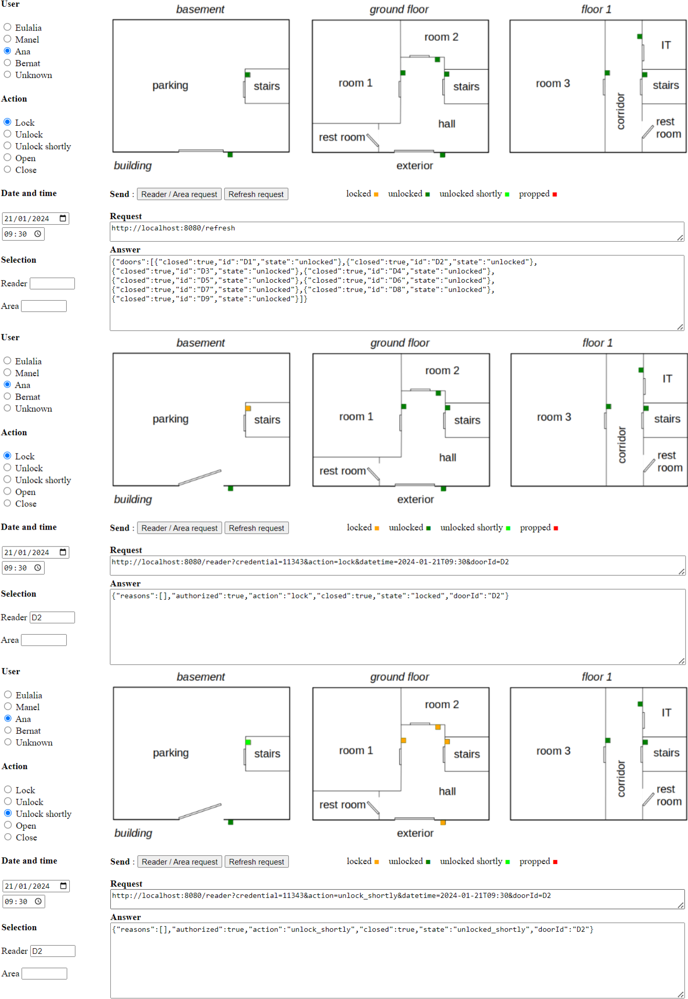
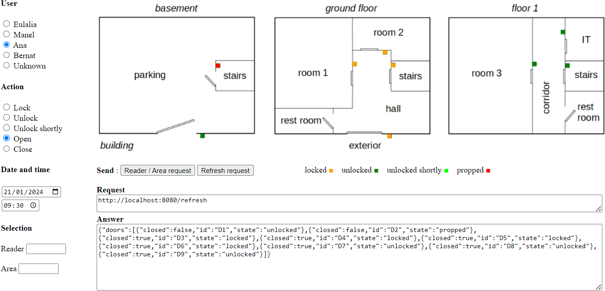
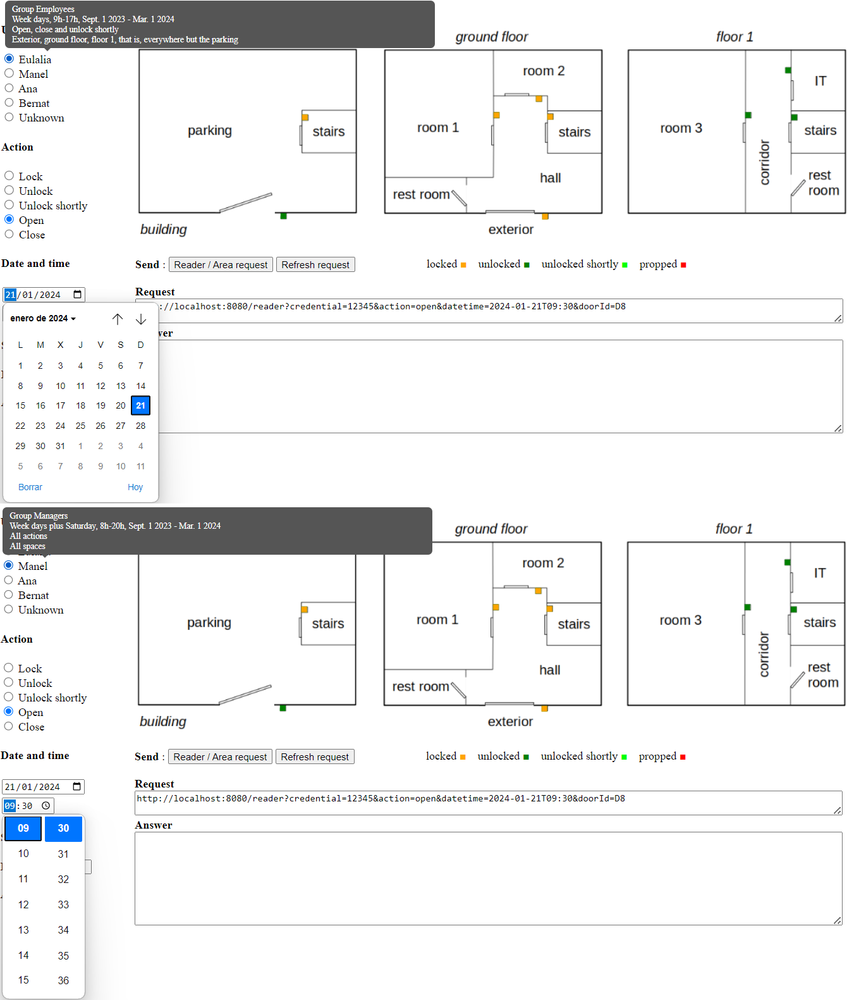

# Access System Control
This project contains two parts, the first is the Access Control system, where you can interact with the areas of a building based on the user, date and time.

The second is the web server that allows us to use the API to interact with the [Flutter version](https://github.com/R0drigo-0/Access-Control-System).

## Actions

### Doors and Areas
We can select to interact with a door or an Area.
The **actions** for a **door** are:
* Open
* Close
* Lock
* Unlock
* Unlock Shortly

The **actions** for an **area** are:
* Lock
* Unlock

If the door was unlocked shortly, and it's open after 10 seconds, the door is in **propped** state and we have to close it manualy.

### Date and Time permissions
We can configure an user by permissions and select the day and time to open an door, in the app version this data is given by the device.

### Log
To know the state of the server, we can see all the logs in the *+log.html**

